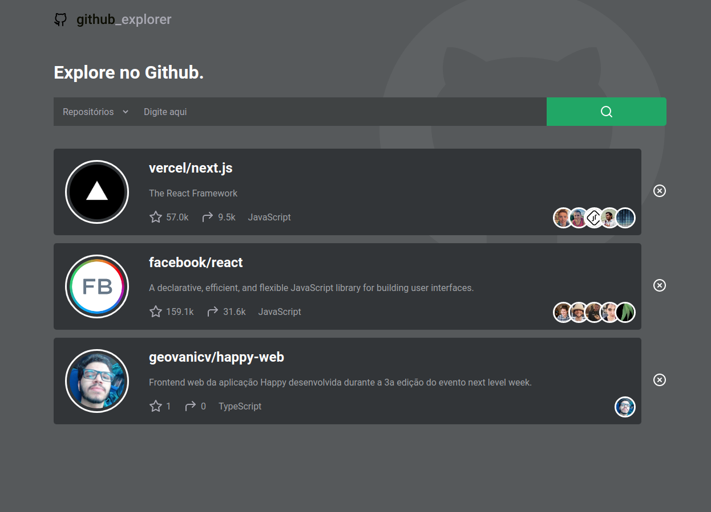
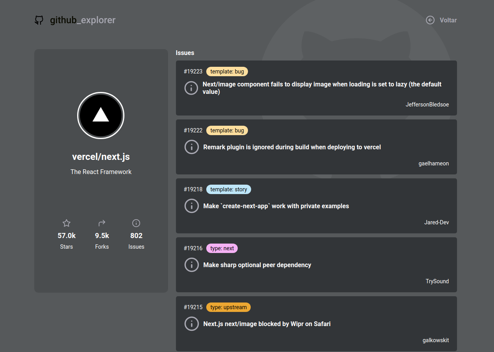
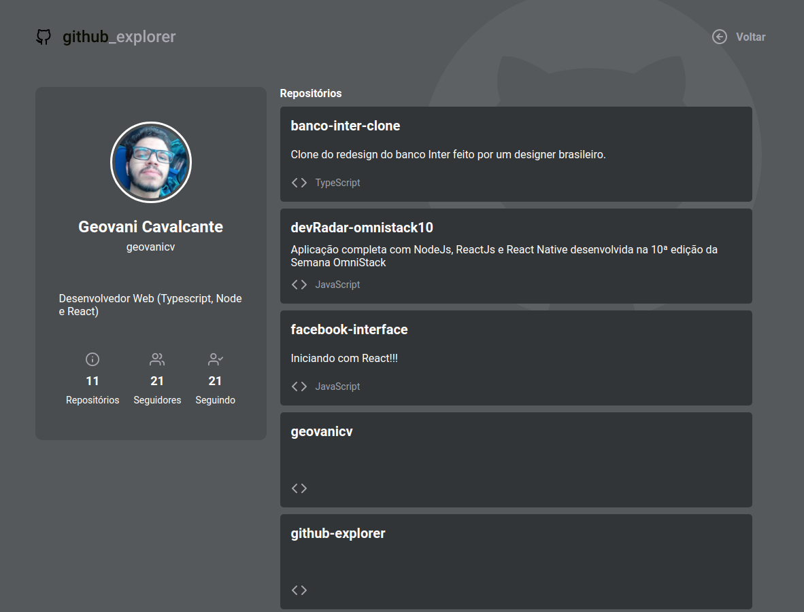

  

 

# :memo: Sobre

Github explorer é uma aplicação desenvolvida com reactjs consumindo a API do github para buscar usuários e repositórios. Criei o Layout a partir da versão que foi desenvolvida no bootcamp gostack da rocketseat. Modifiquei totalmente e adicionei novas funcionalidades. O resultado ficou ótimo e você pode conferir logo abaixo:

  
  

  
  

  
  

  
  

# :rocket: Technologies
This project was developed with the following technologies:

- ReactJS
- Typescript
- styled-components
- react-router-dom
- Fetch API

---
Made with :purple_heart: by Geovani Cavalcante :wave: [Get in touch!](https://www.linkedin.com/in/geovani-cv/)
